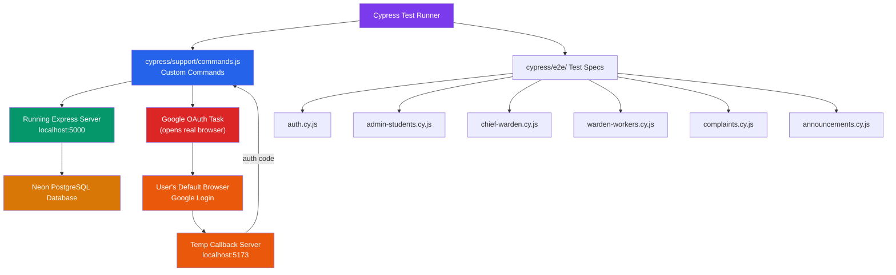

# Cypress API Testing Framework for FixMyCampus Backend

Build an automated headless API testing framework using Cypress to test all backend endpoints directly, covering authentication flows, RBAC enforcement, CRUD operations, and edge cases.

## Architecture Overview



## Design Decisions

### 1. Authentication Strategy

#### Student Login — Real Google OAuth (Interactive)

Google blocks automated browsers, so we can't script the Google login page directly. Instead, we use a **semi-interactive approach**:

1. A Cypress task (`googleLogin`) in `cypress.config.js` does the following at the Node.js level:
   - Constructs the Google OAuth authorization URL using `GOOGLE_CLIENT_ID` and the redirect URI (`http://localhost:5173/auth/callback`)
   - Opens that URL in the **user's default system browser** (via the `open` npm package)
   - Spins up a **temporary HTTP server on port 5173** that listens for the callback
   - When Google redirects back with `?code=...`, the temp server extracts the code, shuts itself down, and returns the code to Cypress
2. The Cypress test then sends the code to `POST /api/auth/google` → backend exchanges it for tokens, verifies the `@nitdelhi.ac.in` email, and sets the JWT cookie
3. All subsequent requests in the test automatically carry the cookie

> [!NOTE]
> This means the **first run** of student-related tests requires manual Google login in the popup browser. Cypress caches the session cookie for the remainder of the suite run via `cy.session()`, so you only log in once per suite.

#### Admin & Worker Login — Fully Automated (Headless)

These use the standard `POST /api/auth/login` endpoint with email + password — no browser interaction needed:

- `cy.loginAsAdmin(email, password)` — `role: "admin"`
- `cy.loginAsWorker(email, password)` — `role: "worker"`

### 2. Test Data Strategy

- Tests use **pre-seeded data already in the Neon database** (existing admins, students, workers, hostels)
- For create/delete tests, we **clean up after ourselves** — e.g., delete any student added during a test
- We will **not** drop or recreate tables — tests are safe to run against the dev database

### 3. Environment Configuration

- A `cypress.env.json` file (gitignored) holds credentials and config
- `cypress.config.js` sets `baseUrl` to `http://localhost:5000`

> [!IMPORTANT]
> The backend server must be running on `localhost:5000` before executing tests. The frontend does **not** need to be running — the temp callback server replaces it for the OAuth flow.

## Open Questions

> [!IMPORTANT]
> **Admin test credentials**: Do you have a known **Chief Warden** account (email + password) and a known **Hostel Warden** account (email + password) already in the database? If not, I'll create a seed script to insert test accounts.

> [!IMPORTANT]
> **Worker test credentials**: Same question — do you have a worker account with known credentials?

> [!IMPORTANT]
> **Google OAuth redirect URI**: Your OAuth redirect is `http://localhost:5173/auth/callback`. Is port **5173** correct? Also, is `http://localhost:5173/auth/callback` registered as an authorized redirect URI in your Google Cloud Console? (The temp server needs to match exactly.)

## Proposed Changes

### Cypress Installation & Configuration

#### [NEW] [cypress.config.js](./cypress.config.js)

- `baseUrl: 'http://localhost:5000'`
- `video: false`, `screenshotOnRunFailure: false` (headless API testing, no UI)
- `defaultCommandTimeout: 10000`
- `setupNodeEvents`: Registers the `googleLogin` task that:
  - Reads `GOOGLE_CLIENT_ID` from env
  - Builds the OAuth consent URL with `response_type=code`, `redirect_uri=http://localhost:5173/auth/callback`, `scope=openid email profile`, `access_type=offline`, `prompt=consent`
  - Opens the URL via `open` (npm package)
  - Creates an `http.createServer` on port 5173 listening for `GET /auth/callback?code=...`
  - Returns the captured authorization code
  - Timeout of 120 seconds (for manual login)

#### [NEW] [cypress.env.json](./cypress.env.json)

```json
{
  "ADMIN_EMAIL": "<junior_assistant_email>",
  "ADMIN_PASSWORD": "<junior_assistant password>",
  "CHIEF_WARDEN_EMAIL": "<chief_warden_email>",
  "CHIEF_WARDEN_PASSWORD": "<chief_warden_password>",
  "WARDEN_EMAIL": "<hostel_warden_email>",
  "WARDEN_PASSWORD": "<hostel_warden_password>",
  "WORKER_EMAIL": "<worker_email>",
  "WORKER_PASSWORD": "<worker_password>",
  "GOOGLE_CLIENT_ID": "999538032208-...",
  "GOOGLE_CLIENT_SECRET": "GOCSPX-..."
}
```

#### [MODIFY] [.gitignore](./.gitignore)

- Add `cypress.env.json`, `cypress/videos`, `cypress/screenshots`

#### [MODIFY] [package.json](./package.json)

- Add `cypress` and `open` as devDependencies
- Add scripts: `"test": "cypress run"`, `"test:open": "cypress open"`

---

### Test Support Infrastructure

#### [NEW] [cypress/support/e2e.js](./cypress/support/e2e.js)

- Imports custom commands

#### [NEW] [cypress/support/commands.js](./cypress/support/commands.js)

Custom Cypress commands:

| Command                             | How It Works                                                                                                                                                                                                                 |
| ----------------------------------- | ---------------------------------------------------------------------------------------------------------------------------------------------------------------------------------------------------------------------------- |
| `cy.loginAsStudent()`               | Calls `cy.task('googleLogin')` → opens Google consent in default browser → captures auth code → sends `POST /api/auth/google` with the code → cookie is set. Wrapped in `cy.session()` so login only happens once per suite. |
| `cy.loginAsAdmin(email, password)`  | `POST /api/auth/login` with `role: "admin"` — fully automated                                                                                                                                                                |
| `cy.loginAsWorker(email, password)` | `POST /api/auth/login` with `role: "worker"` — fully automated                                                                                                                                                               |
| `cy.logout()`                       | `POST /api/auth/logout`, clears cookies                                                                                                                                                                                      |
| `cy.api(method, url, body?)`        | Wrapper around `cy.request` with `failOnStatusCode: false` for testing error responses                                                                                                                                       |

---

### Test Specs (~60 tests across 6 files)

#### [NEW] [cypress/e2e/auth.cy.js](./cypress/e2e/auth.cy.js)

**Auth & Session Management** (~10 tests)

- `POST /api/auth/login` — valid admin login, valid worker login
- `POST /api/auth/login` — missing fields (400), wrong password (401), invalid role (400), non-existent email (401)
- `POST /api/auth/google` — student login via real Google OAuth (interactive)
- `GET /api/auth/profile` — returns correct user data when authenticated (admin, worker, student)
- `GET /api/auth/profile` — returns 401 when not authenticated
- `POST /api/auth/logout` — clears cookie, subsequent profile fetch fails
- `PUT /api/auth/admin/profile/password` — change password flow (change → revert)

---

#### [NEW] [cypress/e2e/admin-students.cy.js](./cypress/e2e/admin-students.cy.js)

**Admin Student Management** (~12 tests)

- `GET /api/admin/students` — paginated list (check `students`, `pagination` shape)
- `GET /api/admin/students?search=...` — search filter
- `GET /api/admin/students?sortBy=name&sortOrder=DESC` — sorting
- `POST /api/admin/students/add` — create student → verify → delete (cleanup)
- `POST /api/admin/students/add` — duplicate roll_no/email → 400
- `POST /api/admin/students/add` — missing required fields → 400
- `PUT /api/admin/students/:id` — update student fields
- `PUT /api/admin/students/:id` — no valid fields → 400
- `DELETE /api/admin/students/:id` — delete student
- `DELETE /api/admin/students/:id` — non-existent ID → 404
- `POST /api/admin/students/bulk-delete` — bulk delete
- `GET /api/admin/students/export` — CSV export (check `Content-Type: text/csv`)
- RBAC: unauthenticated request → 403

---

#### [NEW] [cypress/e2e/chief-warden.cy.js](./cypress/e2e/chief-warden.cy.js)

**Chief Warden Admin Management** (~10 tests)

- `GET /api/admin/chief/wardens` — list all wardens
- `POST /api/admin/chief/wardens` — create warden → verify `generatedPassword` → cleanup
- `POST /api/admin/chief/wardens` — missing fields → 400
- `POST /api/admin/chief/wardens` — duplicate email → 400
- `PUT /api/admin/chief/wardens/:id` — update warden
- `DELETE /api/admin/chief/wardens/:id` — delete warden
- `GET /api/admin/chief/hostel-analytics` — analytics array
- RBAC: non-Chief-Warden admin → 403
- RBAC: unauthenticated → 403

---

#### [NEW] [cypress/e2e/warden-workers.cy.js](./cypress/e2e/warden-workers.cy.js)

**Warden Worker Management** (~10 tests)

- `GET /api/admin/warden/workers` — list workers for hostel
- `POST /api/admin/warden/workers` — create worker → verify → cleanup
- `POST /api/admin/warden/workers` — missing fields → 400
- `POST /api/admin/warden/workers` — duplicate email → 400
- `PUT /api/admin/warden/workers/:id` — update worker
- `DELETE /api/admin/warden/workers/:id` — delete worker
- `GET /api/admin/warden/performance` — performance stats shape
- `GET /api/admin/warden/workers/:id/complaints` — paginated complaints
- RBAC: non-warden → 403

---

#### [NEW] [cypress/e2e/complaints.cy.js](./cypress/e2e/complaints.cy.js)

**Complaint Lifecycle** (~10 tests)

- `POST /api/complaints/student` — lodge complaint (student auth via Google OAuth)
- `POST /api/complaints/student` — missing fields → 400
- `POST /api/complaints/student` — duplicate active complaint → 400
- `GET /api/complaints/student/dashboard` — stats + history shape
- `GET /api/complaints/student/dashboard?status=Resolved` — filter
- `PUT /api/complaints/student/:id/escalate` — escalation (may 400 due to 3-day rule)
- `PUT /api/complaints/student/:id/feedback` — provide rating/feedback
- `GET /api/complaints/worker/dashboard` — worker dashboard stats
- `PUT /api/complaints/worker/:id/resolve` — resolve complaint
- RBAC: student can't access worker routes, worker can't access student routes

---

#### [NEW] [cypress/e2e/announcements.cy.js](./cypress/e2e/announcements.cy.js)

**Announcements** (~8 tests)

- `GET /api/announcements` — returns array (as admin)
- `GET /api/announcements` — filtered set (as student with hostel)
- `POST /api/announcements` — create Common (as Chief Warden)
- `POST /api/announcements` — create Hostel (as Hostel Warden)
- `POST /api/announcements` — missing fields → 400
- RBAC: student can't create → 403
- RBAC: worker can only create "Worker" type → 403 for others
- RBAC: unauthenticated → no data

---

#### [NEW] [cypress/fixtures/test-student.csv](./cypress/fixtures/test-student.csv)

- Sample CSV for testing the `/upload-csv` endpoint

## Verification Plan

### Automated Tests

```bash
# Run all tests headless (will prompt for Google login once)
npx cypress run

# Run a specific spec
npx cypress run --spec "cypress/e2e/auth.cy.js"

# Open interactive runner (for debugging)
npx cypress open
```

### Expected Outcome

- **~60 tests** across 6 spec files
- All tests pass against the running dev server
- Student tests prompt for one-time Google login in default browser
- Admin/worker tests run fully headless
- Tests are idempotent — can run multiple times safely
